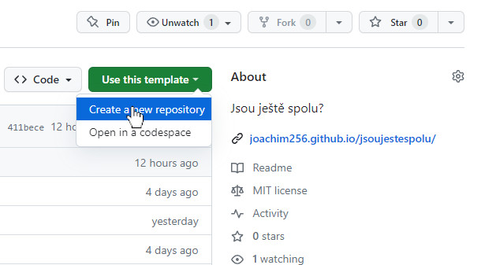
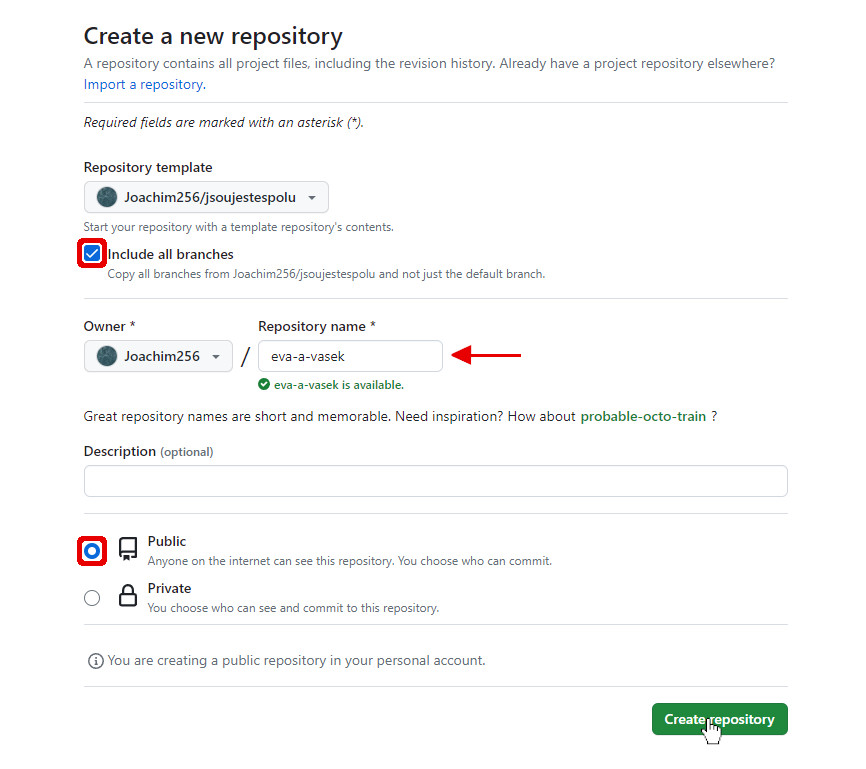
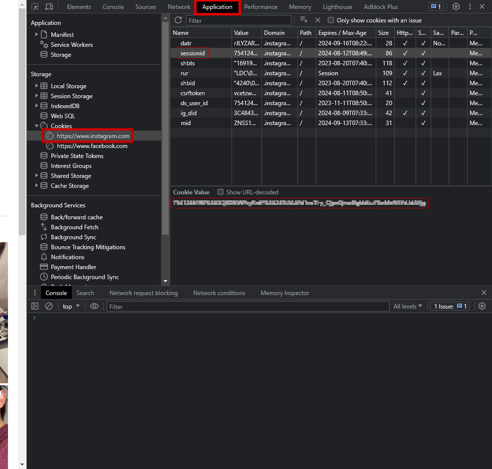
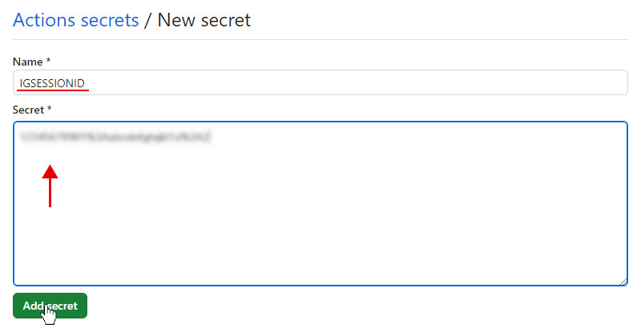
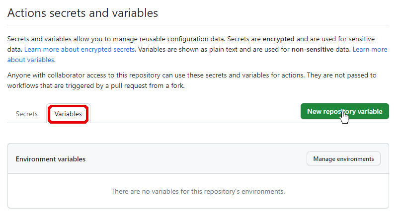
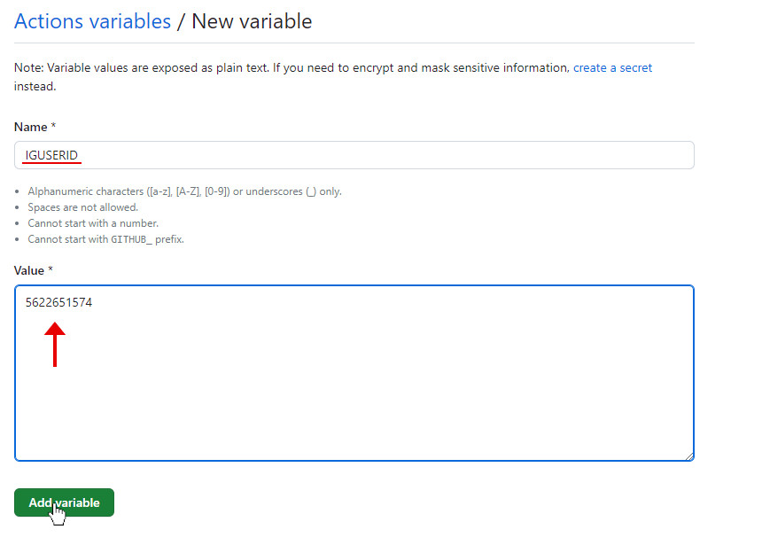
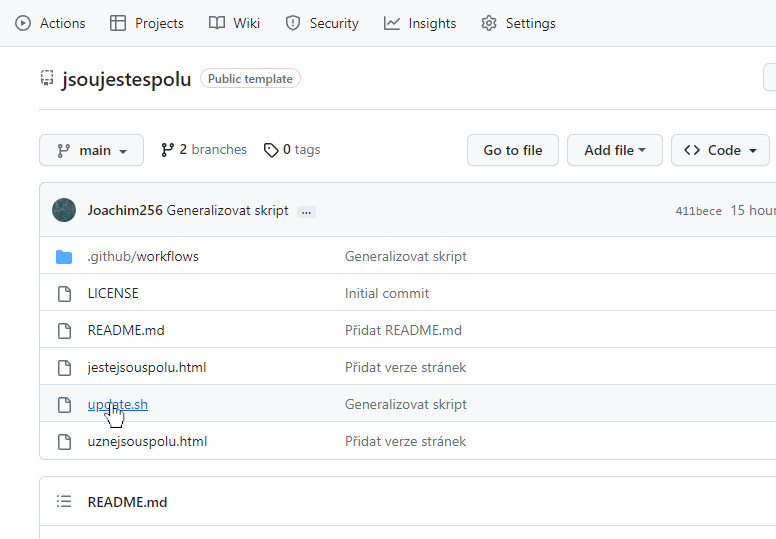
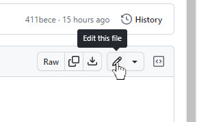
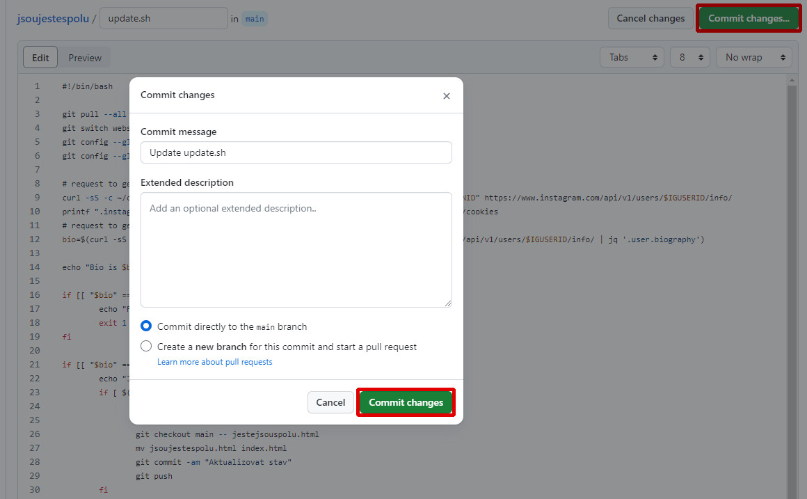
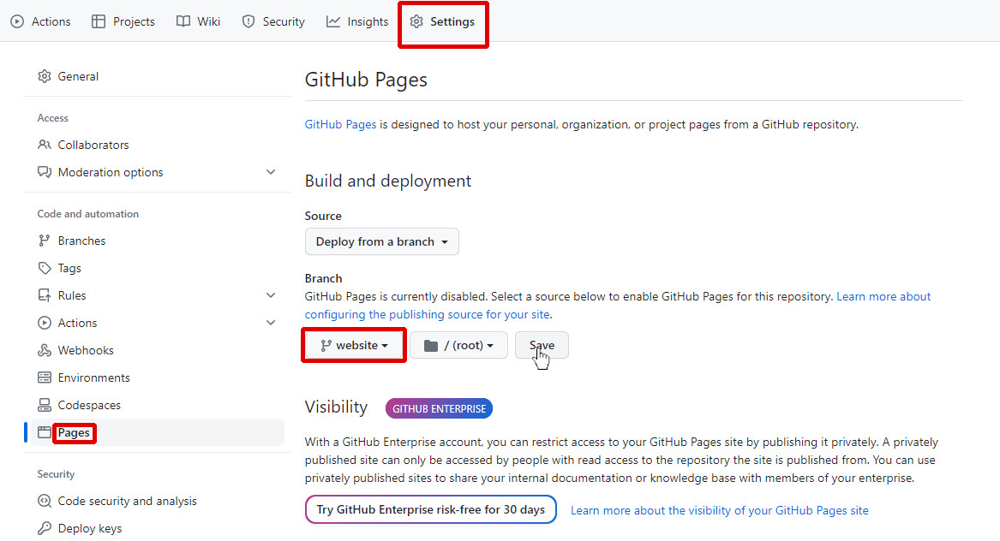

## Návod

1. Vytvořte repozitář z této šablony

Vpravo nahoře klikněte na **Use this template > Create a new repository**.



Zaškrtněte **Include all branches**, zvolte název a klikněte **Create repository**.



1. Zjistěte svůj instagram sessionid

	1. Otevřete [https://www.instagram.com/](https://www.instagram.com/) v prohlížeči na počítači.

	1. Otevřete DevTools (klávesa F12)

		Otevřete kartu **Application**, rozbalte menu **Cookies**, rozklikněte *www.instagram.com* a klikněte na řádek s názvem **sessionid**. Zkopírujte hodnotu dole.

		

		> Tuto hodnotu udržujte v tajnosti, neboť umožňuje přístup do vašeho účtu. Tady ji potřebujeme pro načtení bia, což mohou pouze přihlášení uživatelé.

1. Zjistěte instagramové id účtu, který chcete sledovat

	Najděte si na instagramu účet, jehož bio prozradí, zda-li jsou spolu nebo ne. 

	Zjistit ID instagramového účtu můžete na [online webové stránce](https://commentpicker.com/instagram-user-id.php) *(jednoduché)* nebo přes DevTools záložku _Network_ *(pro zkušené; doporučeno)*.
	
	> DevTools: ID účtu=$.data.user.id v JSON response na request na https<nolink>://www.instagram.com/api/v1/users/web_profile_info/?username=*username*

1. Přidejte proměnné do repozitáře

	1. Na vytvořeném repozitáři klikněte na **Settings > Secrets and variables > Actions > New repository secret**

		

	1. Do názvu zadejte: **IGSESSIONID** a do pole vložte sessionid, poté klikněte na **Add secret**

		

	1. Překlikněte na **Variables** a klikněte na **New repository variable**

		

		Do názvu zadejte: **IGUSERID** a do pole zadejte instagramové id účtu, poté klikněte na **Add variable**

		

1. Upravte podmínku

	Nyní je potřeba nastavit vlastní podmínku, která rozhodne, jestli jsou spolu nebo ne.

	1. V repozitáři otevřete soubor `update.sh`

		

	1. Klikněte na ikonu tužky vpravo nahoře

		

	1. Změňte podmínku

		Upravte si podmínku, která vyhodnotí, jestli jsou spolu nebo ne. Nachází se na řádku **21**.

		Pokud je tato podmínka pravdivá, bude zobrazováno *jsou spolu*.  
		Tady je pár příkladů:

		> Bude pravdivá, pokud bio obsahuje daný text:

		```bash
		if [[ "$bio" == *"@my_boyfriend"* ]]; then
		```

		> Bude pravdivá, pokud bio obsahuje alespoň jeden z textů:

		```bash
		if [[ "$bio" == *"🤍"* ]] || [[ "$bio" == *"😘"* ]]; then
		```
	
	1. Uložte změny

		Vpravo nahoře klikněte na **Commit changes...** a v okénku, které vyskočilo opět **Commit changes**

		

1. Spusťte webovou stránku

	1. Na repozitáři klikněte na **Settings > Pages**, v sekci **Branch** vyberte **website**, poté potvrďte kliknutím na **Save**

		

		Budete muset chvíli počkat, než se stránka nastaví...

1. Hotovo!

	Otevřete webovou stránku https://*uzivatelske-jmeno*.github.io/*nazev-repozitare* a uvidíte to.
